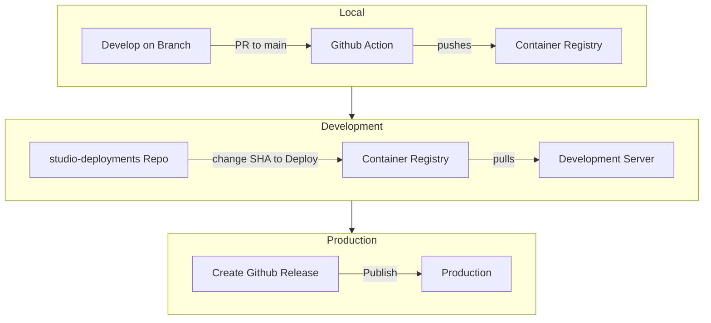

```mermaid
graph TD
    subgraph Local["Local"]
        A["Develop on Branch"]
        C["Github Action"]
        A -->|PR to main | C
        C -->|pushes| D["Container Registry"]
    end
    
    subgraph Development["Development"]
        E["studio-deployments Repo"]
        G["Development Server"]
        cd["Container Registry"]
        E -->|change SHA to Deploy| cd
        cd --> |pulls | G
    end
    
    subgraph Production["Production"]
        H["Create Github Release"]
        J["Production"]
        H -->|Publish | J
    end
    
    Local -->| | Development
    Development --> | | Production
```

